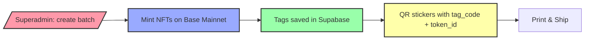

# RanchLink v1.0 - Frontend Architecture & Flows

## Overview

RanchLink v1.0 is a production-ready system for blockchain-linked livestock tags. The frontend provides an intuitive, executive-level interface that makes the powerful backend and on-chain architecture feel like "useful magic" for normal users.

**Key Principle:** The blockchain complexity is hidden behind a clean, trustworthy UI that clearly shows on-chain status without overwhelming users.

---

## Main Flows

### Flow 1: Factory → Batch → Tags → Chain → QR



**Steps:**
1. Admin goes to `/superadmin` → QR Generator tab
2. Configures batch (size, material, model, color, name)
3. Clicks "Generate & Mint Tags"
4. System:
   - Creates batch in `batches` table
   - Creates tags in `tags` table
   - Mints NFTs on Base Mainnet (pre-mint)
   - Updates tags with `token_id` and `contract_address`
   - Returns QR codes with all info
5. Admin sees:
   - Success message with on-chain status
   - Table of tags with token_id, contract_address, on-chain status
   - QR codes ready for printing
   - Each QR sticker shows: Tag ID, Token ID, Animal ID (pending), On-chain status

---

### Flow 2: QR → Tag Scan → Attach → Animal Card

```mermaid
flowchart LR
    QR[Scan QR Code] --> Scan[/t/[tag_code]/]
    Scan --> Check{Tag attached?}
    Check -->|No| Attach[Attach Animal Form]
    Check -->|Yes| Animal[/a/[public_id]/]
    Attach --> Animal
    Animal --> Dashboard[/dashboard/]
    
    style QR fill:#ffa,stroke:#333,stroke-width:2px
    style Scan fill:#9af,stroke:#333,stroke-width:2px
    style Attach fill:#9fa,stroke:#333,stroke-width:2px
    style Animal fill:#f9a,stroke:#333,stroke-width:2px
```

**Steps:**
1. User scans QR code on physical tag
2. Lands on `/t/[tag_code]`
3. Page shows:
   - Tag info (tag_code, status, activation_state)
   - Blockchain info (token_id, chain, on-chain status, Basescan link)
4. If tag not attached:
   - Shows "Attach Animal" form
   - User fills: name, species, breed, birth_year, sex
   - Submits → POST `/api/attach-tag`
   - Creates animal in `animals` table
   - Updates tag (animal_id, status = 'attached')
   - Redirects to `/a/[public_id]`
5. If tag already attached:
   - Shows animal summary
   - Button "View full animal record" → `/a/[public_id]`

---

### Flow 3: Animal Card → Dashboard

```mermaid
flowchart LR
    Animal[/a/[public_id]/] --> Info[Animal Info]
    Info --> Tag[Tag + Blockchain Info]
    Tag --> Basescan[Basescan Link]
    Animal --> Dashboard[/dashboard/]
    Dashboard --> Stats[Stats + Animals + Inventory]
    
    style Animal fill:#f9a,stroke:#333,stroke-width:2px
    style Dashboard fill:#9af,stroke:#333,stroke-width:2px
```

**Steps:**
1. User visits `/a/[public_id]`
2. Page shows:
   - Animal information (name, species, breed, sex, age, status)
   - Tag information (tag_code, status)
   - Blockchain information (token_id, chain, on-chain status)
   - Basescan link (if on-chain)
   - Ranch information (if available)
3. User can navigate to:
   - Dashboard (back button)
   - Tag details (`/t/[tag_code]`)

---

### Flow 4: Dashboard Overview

```mermaid
flowchart TD
    Dashboard[/dashboard/] --> Stats[High-Level Stats]
    Stats --> Animals[Animals View]
    Stats --> Inventory[Inventory View]
    Animals --> AnimalCard[/a/[public_id]/]
    Inventory --> TagScan[/t/[tag_code]/]
    
    style Dashboard fill:#9af,stroke:#333,stroke-width:2px
    style Stats fill:#ffa,stroke:#333,stroke-width:2px
    style Animals fill:#9fa,stroke:#333,stroke-width:2px
    style Inventory fill:#f9a,stroke:#333,stroke-width:2px
```

**Components:**
1. **High-Level Stats:**
   - Total Animals
   - Active Animals
   - Total Tags
   - On-Chain Tags

2. **Tags Status Breakdown:**
   - In Inventory
   - Assigned
   - Attached
   - Retired

3. **Animals View:**
   - Cards showing each animal
   - Tag info and on-chain status per animal
   - Link to animal card

4. **Inventory View:**
   - Table of all tags
   - Filters (status, activation, on-chain)
   - Links to tag scan and Basescan

---

## Pages

### 1. `/superadmin` - Factory

**Purpose:** Generate batches of tags with pre-minting on Base Mainnet.

**Key Features:**
- Batch creation form (size, material, model, color, name)
- Real-time minting status
- Batch result panel with table of tags
- QR codes for printing
- On-chain status indicators

**UI Requirements:**
- Clear loading state: "Generating and minting tags on-chain..."
- Success message with summary (N tags, X on-chain, Y pending)
- Table showing: tag_code, token_id, contract_address (shortened), chain, status, on-chain status
- QR stickers showing: Tag ID, Token ID, Animal ID (pending), On-chain status
- Error handling for failed mints

**Data Flow:**
```
User Input → POST /api/factory/batches
→ Creates batch in Supabase
→ Creates tags in Supabase
→ Mints NFTs on Base (via mintTagUnified)
→ Updates tags with token_id + contract_address
→ Returns tags array
→ UI displays table + QR codes
```

---

### 2. `/t/[tag_code]` - Tag Scan

**Purpose:** Landing page when user scans a tag QR code.

**Key Features:**
- Tag information display
- Blockchain status (on-chain/off-chain)
- Attach animal form (if not attached)
- Redirect to animal card (if attached)

**UI Requirements:**
- Tag info card: tag_code, status, activation_state
- Blockchain card: token_id, chain, on-chain status, Basescan link
- Attach form: name, species, breed, birth_year, sex
- Loading states
- Error handling

**Data Flow:**
```
GET /api/tags/[tag_code]
→ Returns tag + animal (if attached) + ranch
→ If animal_id exists: redirect to /a/[public_id]
→ If no animal_id: show attach form
→ POST /api/attach-tag
→ Creates animal, updates tag
→ Redirects to /a/[public_id]
```

---

### 3. `/a/[public_id]` - Animal Card

**Purpose:** Public-facing animal record with blockchain verification.

**Key Features:**
- Animal information
- Tag information
- Blockchain information (token_id, Basescan link)
- Ranch information

**UI Requirements:**
- Clean, professional layout (like a medical record)
- Prominent blockchain status
- Basescan link for verification
- Navigation to dashboard and tag details

**Data Flow:**
```
GET /api/animals/[public_id]
→ Returns animal + tags + ranch
→ Displays all info
→ Links to Basescan if on-chain
```

---

### 4. `/dashboard` - Ranch Dashboard

**Purpose:** Executive dashboard for ranch management.

**Key Features:**
- High-level stats
- Animals view (cards)
- Inventory view (table with filters)
- On-chain status indicators

**UI Requirements:**
- Stats cards: Total Animals, Active, Total Tags, On-Chain Tags
- Tags breakdown: In Inventory, Assigned, Attached, Retired
- Animals view: Cards with animal info + tag + blockchain status
- Inventory view: Table with filters (status, activation, on-chain)
- All on-chain status clearly visible

**Data Flow:**
```
GET /api/dashboard/animals
GET /api/dashboard/tags
→ Returns animals + tags for current ranch
→ Calculates stats
→ Displays in views
```

---

### 5. `/claim-kit` - Kit Claim

**Purpose:** Allow ranchers to claim retail kits.

**Key Features:**
- Kit code input
- Ranch information form
- Success confirmation

**UI Requirements:**
- Simple, friendly form
- Clear success message
- Next steps guidance

**Data Flow:**
```
POST /api/claim-kit
→ Validates kit_code
→ Creates ranch
→ Updates tags.ranch_id
→ Returns success
```

---

## Data & Contracts

### Contract Registry

The system uses a Contract Registry pattern to support multiple contracts and standards:

```typescript
// apps/web/lib/blockchain/contractRegistry.ts
getContractForAsset(assetType: 'cattle' | 'licensed_products' | ...)
→ Returns ContractConfig from contracts table
→ Used by mintTagUnified() to select correct contract
```

**Current Contract:**
- **Name:** RanchLinkTagUpgradeable
- **Standard:** ERC-721
- **Network:** Base Mainnet (Chain ID: 8453)
- **Address:** `0xCE165B70379Ca6211f9dCf6ffe8c3AC1eedB6242` (PROXY)
- **Pattern:** UUPS (Universal Upgradeable Proxy Standard)

**Future Contracts:**
- ERC-3643 (RWA compliance) - for licensed products
- ERC-7518 (DyCIST) - for advanced features

---

### Database Schema (v1.0)

**Core Tables:**
- `tags` - Canonical source for all tags
  - `tag_code` (RL-001)
  - `token_id` (on-chain token ID)
  - `contract_address` (contract address)
  - `chain` (BASE)
  - `status` (in_inventory | assigned | attached | retired)
  - `activation_state` (active | inactive)
  - `batch_id`, `ranch_id`, `animal_id`

- `animals` - Animal records
  - `public_id` (AUS0001)
  - `name`, `species`, `breed`, `sex`, `birth_year`, `status`
  - `ranch_id`

- `batches` - Factory batches
  - `name`, `model`, `material`, `color`, `count`
  - `target_ranch_id`

- `contracts` - Contract registry
  - `name`, `symbol`, `contract_address`, `chain`, `standard`, `default_for`

- `ranches` - Ranch information
  - `name`, `contact_email`, `phone`

- `kits` - Retail kits
  - `kit_code`, `status`, `claimed_ranch_id`

- `kit_tags` - Kit-to-tag mapping
  - `kit_id`, `tag_id`

---

## On-Chain State Visibility

### On-Chain Status Indicators

Throughout the UI, on-chain status is shown with clear indicators:

- **✅ ON-CHAIN:** `token_id > 0` AND `contract_address` is set
- **⚪ OFF-CHAIN:** `token_id` is null/0
- **🔴 ERROR:** `token_id` exists but `contract_address` is missing

### Where Status is Shown:

1. **Superadmin Factory:**
   - Batch result table
   - QR stickers
   - Latest batch panel

2. **Tag Scan Page:**
   - Tag info card
   - Blockchain section

3. **Animal Card:**
   - Tags & Blockchain section
   - Prominent indicator

4. **Dashboard:**
   - Animals view (per animal card)
   - Inventory view (per tag row)
   - High-level stats (on-chain count)

---

## Future: LastBurner & Non-Custodial

### Current State (v1.0):
- **Fully Custodial:** Server wallet owns all NFTs
- Tags are minted to server wallet address
- Ranchers manage animals via dashboard, but don't own NFTs on-chain

### Future State (Roadmap):
- **LastBurner Kits:** Ranchers receive Burner cards with tags
- Tags are minted directly to rancher's Burner address
- Ranchers own NFTs on-chain
- Liquidity flows (USDC, sales) can be wired to rancher's address

### UI Preparation:

**TODOs added in code:**
- `apps/web/lib/blockchain/ranchLinkTag.ts` - `mintTag()` has TODO for `recipientAddress` parameter
- `apps/web/lib/blockchain/mintTag.ts` - TODO for LastBurner recipient support
- `apps/web/app/api/factory/batches/route.ts` - TODO for LastBurner recipient
- `apps/web/app/dashboard/page.tsx` - TODO for showing on-chain owner

**No implementation yet** - just architectural preparation.

---

## Complete Flow Diagram

```mermaid
flowchart TB
    Start[Admin: Generate Batch] --> Factory[/superadmin]
    Factory --> API1[POST /api/factory/batches]
    API1 --> DB1[Create batch + tags in Supabase]
    DB1 --> Chain1[Mint NFTs on Base Mainnet]
    Chain1 --> Update1[Update tags with token_id]
    Update1 --> QR1[Generate QR codes]
    QR1 --> Print1[Print stickers]
    
    Print1 --> Scan[User scans QR]
    Scan --> TagPage[/t/[tag_code]]
    TagPage --> API2[GET /api/tags/[tag_code]]
    API2 --> Check{Tag attached?}
    Check -->|No| AttachForm[Show attach form]
    Check -->|Yes| AnimalPage[/a/[public_id]]
    AttachForm --> API3[POST /api/attach-tag]
    API3 --> DB2[Create animal + update tag]
    DB2 --> AnimalPage
    
    AnimalPage --> API4[GET /api/animals/[public_id]]
    API4 --> Display[Display animal + blockchain info]
    
    Display --> Dashboard[/dashboard]
    Dashboard --> API5[GET /api/dashboard/animals]
    Dashboard --> API6[GET /api/dashboard/tags]
    API5 --> Stats[Show stats + animals]
    API6 --> Inventory[Show inventory]
    
    style Factory fill:#f9a,stroke:#333,stroke-width:2px
    style Chain1 fill:#9af,stroke:#333,stroke-width:2px
    style TagPage fill:#9fa,stroke:#333,stroke-width:2px
    style AnimalPage fill:#ffa,stroke:#333,stroke-width:2px
    style Dashboard fill:#9af,stroke:#333,stroke-width:2px
```

---

## API Endpoints Reference

### Factory:
- `POST /api/factory/batches` - Create batch, mint tags, return QR data

### Tags:
- `GET /api/tags/[tag_code]` - Get tag info by tag_code
- `POST /api/attach-tag` - Attach tag to animal

### Animals:
- `GET /api/animals/[public_id]` - Get animal by public_id

### Dashboard:
- `GET /api/dashboard/animals` - Get animals for current ranch
- `GET /api/dashboard/tags` - Get tags for current ranch

### Kits:
- `POST /api/claim-kit` - Claim retail kit

### Health:
- `GET /api/health` - Health check

---

## UI/UX Principles

1. **Clarity:** On-chain status is always visible and clear
2. **Trust:** Blockchain info is prominent but not overwhelming
3. **Simplicity:** Complex backend logic is hidden behind intuitive UI
4. **Feedback:** Loading states, success messages, error handling
5. **Executive:** Professional, production-ready appearance
6. **Informative:** All relevant data is accessible but organized

---

## Sticker/QR Requirements

Each physical sticker MUST include:

1. **QR Code:** Points to `https://ranch-link.vercel.app/t/[tag_code]`
2. **Human-Readable Text:**
   - Tag ID: `{tag_code}` (e.g., RL-001)
   - Token ID: `#{token_id}` (e.g., #1) or "Pending"
   - Animal ID: `{public_id}` (e.g., AUS0001) or "Not attached"
3. **On-Chain Status:** ✅ ON-CHAIN or ⚪ OFF-CHAIN
4. **Chain Label:** "Base Mainnet" (or abbreviation)

**Print Layout:**
- QR code: 30mm × 30mm
- Text: Clear, readable font
- Status indicator: Color-coded badge
- All info visible at a glance

---

## Next Steps

1. ✅ Factory UI - Rich batch creation with on-chain status
2. ✅ Tag Scan UI - Professional tag page with attach form
3. ✅ Animal Card UI - Clean animal record with blockchain
4. ✅ Dashboard UI - Executive dashboard with stats and views
5. ✅ Kit Claim UI - Simple, friendly claim flow
6. ✅ Architecture diagrams - Visual documentation

**Status:** All frontend pages upgraded and ready for production.

